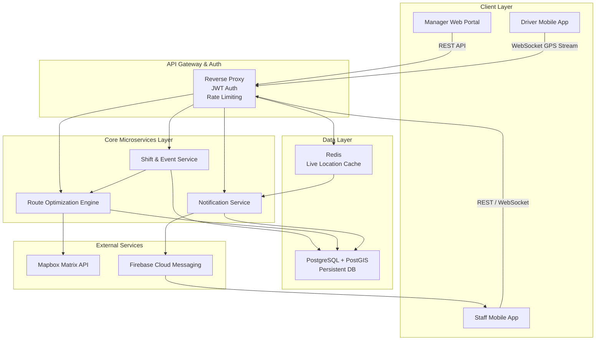
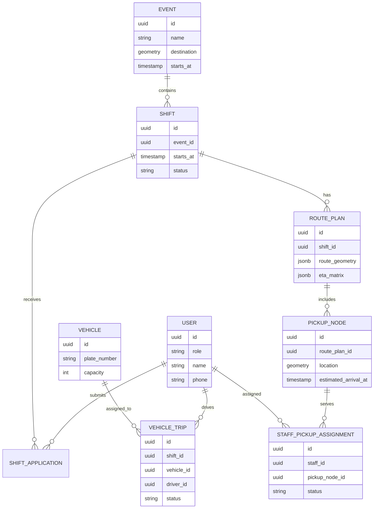

# Smart Catering Fleet & Staff Pickup Platform

An intelligent shift scheduling, route optimization, and live pickup coordination platform for event catering companies. The platform helps managers publish shifts, generate optimized pickup routes for food truck drivers, and send real-time arrival alerts to staff during a trip.

## Problem Statement

Event catering teams often operate across weddings, corporate events, festivals, street markets, and temporary venues. Each event may require a manager to coordinate food trucks, drivers, and part-time staff who are starting from different locations across the city.

Traditional coordination is usually handled through group chats, phone calls, manual location sharing, and route planning by experience. This creates several operational problems:

- Staff members are spread across different areas, making pickup planning slow and error-prone.
- Drivers cannot easily share live location with managers and waiting staff.
- Managers lack a low-latency operations view during an active trip.
- Staff members do not know exactly when the vehicle is approaching their pickup point.
- City traffic, public transport availability, and temporary event locations make scheduling uncertain.

This project aims to build an end-to-end platform that connects shift publishing, staff location collection, route optimization, live GPS tracking, geofencing, and mobile push notifications into one operational workflow.

## Core Objectives

- Provide a Manager Web Portal for creating shifts, selecting staff, assigning vehicles, and triggering route optimization.
- Provide a Driver Mobile App for viewing the route, starting a trip, and continuously uploading GPS coordinates.
- Provide a Staff Mobile App for shift signup, departure location submission, pickup assignment, and arrival alerts.
- Generate optimized pickup routes, pickup nodes, and estimated arrival timelines.
- Use Redis and WebSocket connections for low-latency live vehicle tracking.
- Use PostgreSQL with PostGIS for persistent business and geospatial data.
- Use Firebase Cloud Messaging for high-priority staff notifications.

## High-Level Architecture

## Architecture Layers

### 1. Client Layer

#### Manager Web Portal

The manager-facing dashboard for event and shift operations.

- Create event destinations, shift times, and staffing requirements.
- View registered staff and their departure coordinates.
- Select a food truck, driver, and staff group for a shift.
- Trigger route optimization.
- Monitor live vehicle location, pickup node status, and estimated arrival times.

#### Driver Mobile App

The driver-facing mobile app for executing a trip.

- View the assigned route for the day.
- View pickup nodes and estimated arrival times.
- Start a trip and continuously upload GPS coordinates.
- Receive route changes or dispatch updates.

#### Staff Mobile App

The staff-facing mobile app for shift signup and pickup coordination.

- Sign up for available shifts.
- Submit a default home location or a one-time departure location.
- View assigned pickup point, meeting time, and travel guidance.
- Receive vehicle approach alerts and shift notifications.

### 2. API Gateway & Auth Layer

The API gateway is the unified entry point for all clients.

- Handles REST API requests and WebSocket connections.
- Validates JWT access tokens.
- Applies role-based access control for managers, drivers, and staff.
- Enforces rate limiting to protect backend services.
- Routes GPS streams to Redis and the notification pipeline.

### 3. Core Microservices Layer

#### Shift & Event Service

Owns events, shifts, staff signup, and operational assignments.

- Manages event destinations, shifts, vehicles, and staff signup status.
- Aggregates staff coordinates, driver starting point, and event destination.
- Calls the Route Optimization Engine to generate a route plan.
- Persists the finalized shift plan in PostgreSQL.

#### Route Optimization Engine

Owns route planning and pickup point generation.

- Calls the Mapbox Matrix API to retrieve distance and travel-time matrices.
- Uses a modified Vehicle Routing Problem approach for single-vehicle route planning.
- Evaluates pickup point candidates based on staff locations.
- Balances route deviation, walking distance, and public transport convenience.
- Outputs the driver route, staff pickup assignments, and ETA timeline.

#### Notification Service

Owns real-time geofencing and mobile push notifications.

- Consumes live vehicle GPS coordinates.
- Reads the next pickup node and staff assignment data.
- Uses geospatial logic to determine whether a vehicle entered a pickup geofence.
- Sends high-priority push notifications to relevant staff through FCM.

### 4. Data Layer

#### PostgreSQL + PostGIS

The persistent database for business and geospatial records.

- Users, roles, and authentication records.
- Events, shifts, vehicles, drivers, and staff.
- Staff departure coordinates and pickup node coordinates.
- Optimized routes, ETA matrices, and trip status.
- Geofence and spatial query data.

#### Redis

The live cache layer for low-latency location updates.

- Stores the latest GPS coordinate for each active vehicle.
- Powers live vehicle movement on the manager dashboard.
- Supports WebSocket broadcasting and fast trip status reads.
- Prevents high-frequency GPS writes from overloading the primary database.

## Key Operational Workflows

### Workflow 1: Shift Publishing & Route Optimization

1. A manager selects an event destination, one food truck, and five registered part-time staff members in the Manager Web Portal.
2. The manager clicks "Optimize Route".
3. The Shift & Event Service collects each staff member's default or one-time departure coordinates.
4. The Route Optimization Engine calls the Mapbox Matrix API to calculate distance and travel-time relationships between the driver origin, event destination, and staff locations.
5. The route algorithm generates the main driving path using a modified VRP approach.
6. The system selects three practical pickup nodes along or near the main route.
7. The system creates a full trip plan, including the driver route, pickup node ETAs, and staff-to-pickup assignments.
8. The route plan is persisted in PostgreSQL with PostGIS geospatial data.
9. Relevant staff members receive their pickup point and meeting time in the mobile app.

### Workflow 2: Live Trip Tracking & Geofencing

1. The driver taps "Start Trip" in the Driver Mobile App.
2. The Driver Mobile App uploads vehicle coordinates through WebSocket every 10 seconds.
3. The API Gateway receives coordinate messages in the format `[Vehicle_ID, Latitude, Longitude, Timestamp]`.
4. Redis updates the latest vehicle location, allowing the manager dashboard to render smooth live vehicle movement.
5. The Notification Service consumes the location stream and calculates the distance between the vehicle and the next pickup node.
6. When the vehicle enters the 1km geofence around a pickup node, the notification workflow is triggered.
7. FCM sends a high-priority push notification to staff waiting at that pickup node.

Example notification:

> Your pickup food truck is 1.5 km away and is expected to arrive in 4 minutes. Please get ready for pickup.

## Suggested Technology Stack

| Layer | Suggested Technology |
| --- | --- |
| Manager Web Portal | React / Next.js |
| Driver Mobile App | React Native / Flutter |
| Staff Mobile App | React Native / Flutter |
| API Gateway | NGINX / Kong / Spring Cloud Gateway |
| Auth | JWT / OAuth 2.0 |
| Backend Services | Node.js / NestJS / Java Spring Boot |
| Realtime Transport | WebSocket / Socket.IO |
| Persistent Database | PostgreSQL + PostGIS |
| Live Cache | Redis |
| Route Matrix Provider | Mapbox Matrix API |
| Push Notification | Firebase Cloud Messaging |
| Deployment | Docker / Kubernetes |
| Observability | Prometheus / Grafana / OpenTelemetry |

## Domain Model Draft

## Non-Functional Requirements

- **Realtime Latency**: Manager dashboard vehicle updates should ideally arrive within 1-3 seconds.
- **GPS Upload Frequency**: Driver devices upload coordinates every 10 seconds by default.
- **Geofence Radius**: Pickup node geofences default to 1km and should be configurable.
- **Reliability**: If the GPS stream drops, the system should keep the last known valid coordinate and expose connection status to managers.
- **Security**: All APIs must require authentication and role-based authorization.
- **Privacy**: Staff location data should only be used for pickup coordination and should follow a clear retention policy.
- **Scalability**: Route optimization, notifications, and location streaming should be decoupled so each part can scale independently.

## Future Scalability

### Multi-Vehicle Fleet Routing

As the platform serves larger catering operators, the routing model can evolve from single-vehicle planning to multi-vehicle, multi-origin, multi-destination routing. This would allow the system to automatically split staff across vehicles and assign each person to the most efficient pickup plan.

### ML-Driven Traffic Prediction

Future versions can include historical trip data, city traffic congestion signals, and Dublin Luas / bus real-time APIs. These inputs can help the platform dynamically adjust pickup windows and reduce delays caused by traffic disruption.

### Operational Intelligence

The platform can also generate operational analytics over time:

- Heatmaps of common staff pickup areas.
- Event destination punctuality reports.
- Driver route deviation analysis.
- Peak-hour pickup failure prediction.
- Public transport convenience scoring by pickup zone.

## Initial MVP Scope

The first version should focus on a complete single-vehicle workflow:

- Manager Web Portal creates a shift and selects staff.
- Staff Mobile App submits departure locations.
- Route Optimization Engine generates a single-vehicle pickup plan.
- Driver Mobile App starts a trip and uploads GPS coordinates.
- Manager Web Portal displays live vehicle location.
- Notification Service sends alerts when the vehicle approaches a pickup node.

This MVP validates the core product value: reducing manual dispatch work, improving pickup efficiency, and giving staff more accurate arrival information.
